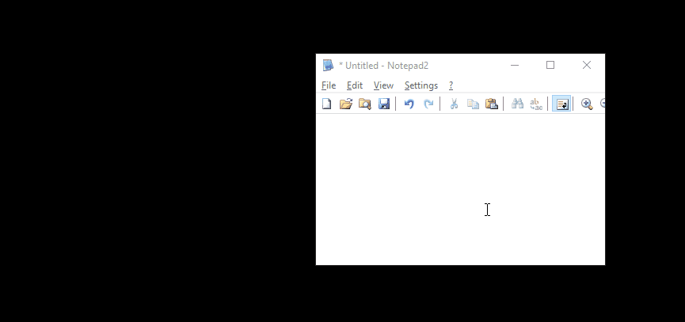
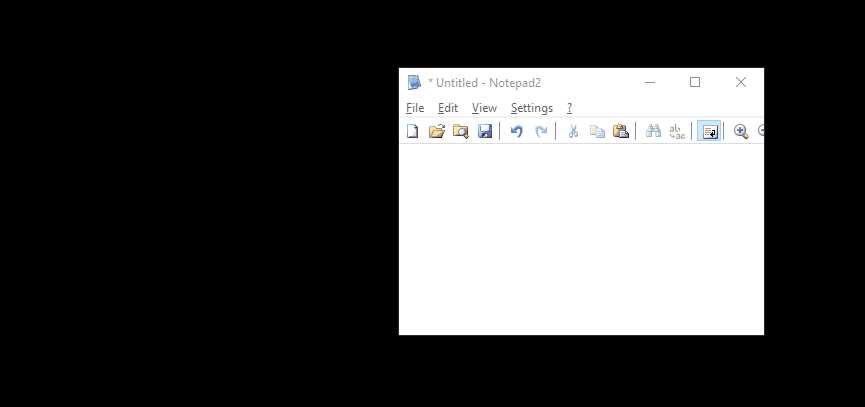

# UnicodeInput
Simple Windows program to write unicode characters. Written in VB.
___
## Usage

Select the desired unicode character in the list that is opened in the main window.

The character will be automatically copied to the clipboard. Then, paste it on the desired location. 

___

## Adding new symbol to the list

To add a new symbol to the main list, select "New" button and type the character code in hexadecimal form, with **four** digits (0000),  in the first edit box of the new window shown.

The character will also be automatically copied to the clipboard. Then, paste it on the desired location.  

To see a reference to a List of Unicode characters in wikipedia, hit the "Ref" button. It will open the webpage shown below in the default web browser.

https://en.wikipedia.org/wiki/List_of_Unicode_characters

