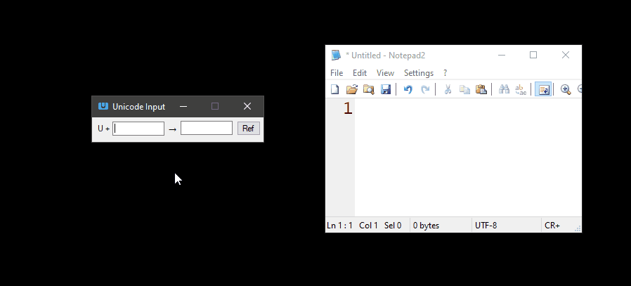
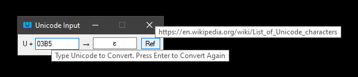

# UnicodeInput
Simple Windows program to write unicode characters. Written in VB.
___
## Usage

Type the character code in hexadecimal form, with **four** digits (0000),  in the first edit box.  

The character will be automatically copied to the clipboard. Then, paste it on the desired location. 

To have the same character copied again to the clipboard, hit ENTER in the application window, or type the character code again. Or just manually copy the character shown in the second edit box.

To see a reference to a List of Unicode characters in wikipedia, hit the "Ref" button. It will open the webpage shown below in the default web browser.

https://en.wikipedia.org/wiki/List_of_Unicode_characters

